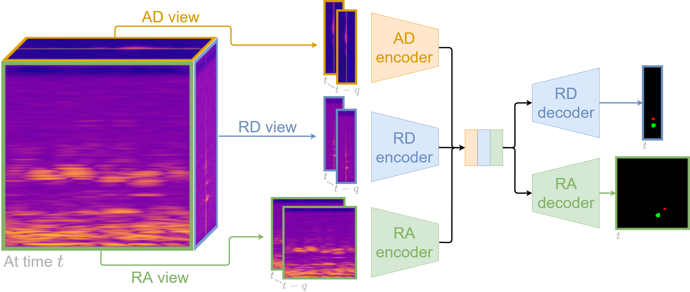
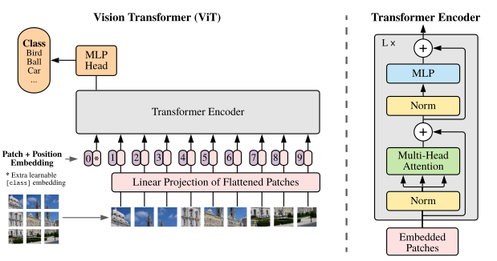
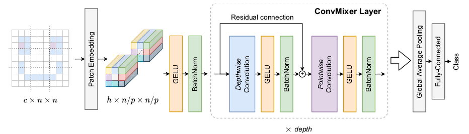

# Introduction

Radars are useful in for autonomous driving because they can be used to detect object (e.g. cards, buses, pedestrians or bikes) around the car. Therefore it's important to make correct predictions. In this case, Deep Learning can be used to detect such object from the resulting radar outputs. The goal of this project is to present and showcase the results of using multiple DL methods to count the number of objects given scenarios detected by a radar.

# Data

The data is split into in a training set with give labels and a testing set which is used to create the submission. The training set images are found in a folder, and along side it, a csv document which contains the label for each file. The data is loaded using the PyTorch Dataset and Dataloader. The Dataset objects are used by the Dataloaders. The processing is defined in the Dataset class, the images are loaded from disk using OpenCV, the channel order is then changed from B,G,R to R,G,B, and finally is passed trough the transformation pipeline. The transformation pipeline is defined using the Torchvision Library @torch . The first step in this pipeline are `ToTensor()` which changes to order of the image channels from HxWxC to CxHxW and normalizes the values in the [0,1] interval, the second step is the `Padding` operation which transforms the images from 128x55 to 128x64. The change is size allows for easier computation of dimension when using Convolution operations.

# Approaches

In the development of the project, multiple approaches were used and all of them are using convolutional neural networks or transformers. An important is to select the output type. Since the task is to count the number of objects in the image, it can be seen as an regression task where the output values must is a discrete value in the [1,5] interval. At the same time, this can be seen as a classification task. In my implementation, I have used both approaches in order to obtain the best result.

## CNN

The first one is a simple convolutional neural network which uses different Conv2d layers, along with a ReLU activation function. For regularization, batch normalization was used, which prevented the model from overfitting.

## ADNet

The ADNet is a subset of the MVRSS architecture from @mvnet. The original architecture handles semantic segmentation from Range-Azimuth-Doppler radar images. In this project, I have taken the branch that handles only the Azimuth part, and used it as the backbone of the model.

{width=50%}

## ViT

The vision transformer was introduced in @dosovitskiy2020vit. The goal of this approach was to bring the ubiquitous transformer from the NLP domain into Computer Vision application. The proposed architecture can be with and without convolutional layers. In this implementation I used the convolution-less model. The intuition behind this approach is that the original image is split into patches, which are passed trough the encoder block. I the encoder part, the embeddings are passed trough the global self attention layers and the local MLP layers. The architecture performs really well on large datasets, whereas on smaller ones it doesn't outperform ResNet. Moreover, the author [@tolstikhin2021mlpmixer, p. 2] points out performance greatly increases on large datasets (>14M images). One improvement in this direction could be made by pre-training the transformer on the @CARRADA dataset, and the fine-tuned to the downstream task.

{width=70%}

## ConvMixer and ConvRepeater

The ConvMixer architecture was introduced in @convmixer, as a combination between @dosovitskiy2020vit and @tolstikhin2021mlpmixer. The author explores the hypothesis that the performance of the vision transformers relies in the patch-based representation, by directly operating on the patches extracted from the input images. In the original implementation, the residual is added to the output of the first convolution, keeping the number of channels consistent across the ConvMixer Layers. In addition to that, I have used another type of ConvMixer Layer, named ConvRepeater, which concatenates the residual information to the output of the first convolution, therefore doubling the number of channels, hoping to gather more information from the initial image.

{width=70%}

# Cross Validation

Since there is no defined validation dataset, in order to properly evaluate the upper mentioned models, the KFold Cross Validation technique was split. For each fold, a section of the training set is kept back and used for evaluating the model. This procedure was done 5 times across the whole dataset and the average MAE was calculated for each model. By training the same architecture for classification and regression we can choose the best approach for each architecture.

\begin{table}[]
\centering
\begin{tabular}{l|c}
Model & MAE \\ \hline
CNN\_C & 1.427 \\
CNN\_R & 1.937 \\
ConvMixer\_C & 1.540 \\
ConvMixer\_R & 1.912 \\
ConvRepeater\_C & 1.801 \\
ConvRepeater\_R & 1.934 \\
ADNet\_C & 1.781 \\
ADNet\_R & 1.973 \\
ViT\_C & 1.511 \\
ViT\_R & 1.718
\end{tabular}
\caption{MAE Score across the models}
\label{tab:my-table}
\end{table}

# Training routine

The train routine was defined using the @Falcon_PyTorch_Lightning_2019 library which removes a lot of the boilerplate code.
The models were trained for a maximum of 100 epochs, with a batch size of the maximum availability and the maximum number of workers.

- Model Checkpoint - saves a checkpoint of the model when the lowest validation loss is achieved;
- Early Stopping - stops the training after the validation loss hasn't decreased.

## Hyper Parameters

In the training loop, the Adam optimizer was used along with a scheduler was used that reduces the learning rate once the validation loss reached a plateau.
The learning rate in the beginning is `0.003`.
The scheduler reduces the learning rate by a factor of `.05` after a certain amount of epoch where the validation loss stagnates.

\begin{table}[h]
\centering
\begin{tabular}{l|c}
Model & Val Accuracy \\ \hline
Random Chance & 0.200 \\ \hline
CNN\_C & 0.180 \\
ConvMixer\_C & 0.498 \\
ConvRepeater\_C & \bf{0.516} \\
ADNet\_C & 0.456 \\
ViT\_C & 0.286
\end{tabular}
\caption{Validation Accuracy}
\label{tab:my-table}
\end{table}

# Conclusion

The best models are presented in the Table \ref{tab:my-table}, with the best model being highlighted.
The outcome of the models is not the most desirable and needs much improvement, during training it was observed that some of the classes are not being correctly learned.

# Bibliography {-}
